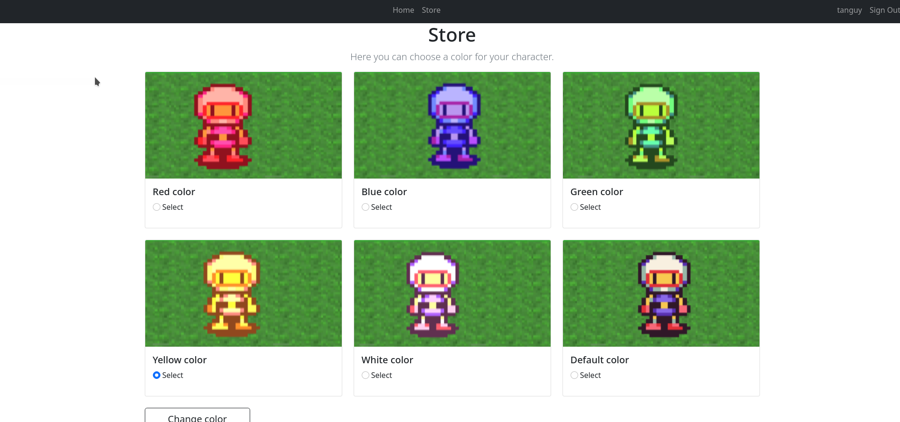

## Table des matières
1. [Info générale](#info-générale)
2. [Technologies](#technologies)
3. [Installation](#installation)
### Info Générale
***
Ce projet a été réalisé dans la cadre de ma formation en master informatique à l'université d'Angers en 1ème années pour le cours de web avancée. 
### Screenshot

## Technologies
***
Liste des technologies utilisées dans le projet :
* [Git](https://git-scm.com/): Version 2.30.0
* [GitKraken](https://www.gitkraken.com/) Version 8.2.1
* [JAVA SE](https://www.oracle.com/java/technologies/javase/jdk16-archive-downloads.html) Version 16
* [Eclipse](https://www.eclipse.org/downloads/packages/release/kepler/sr2/eclipse-ide-java-ee-developers)
* [tomcat](https://tomcat.apache.org/tomcat-10.0-doc/index.html) Version 10.0
* [bootstrap](https://getbootstrap.com/docs/5.1/getting-started/introduction/]) Version 5.1

## Installation
***
Pour installer le projet vous pouvez le cloner avec une clé SSH, ou bien télécharger le dossier ZIP.
```
$ git@github.com:tanguy-sudo/JeeBomberman.git

```
